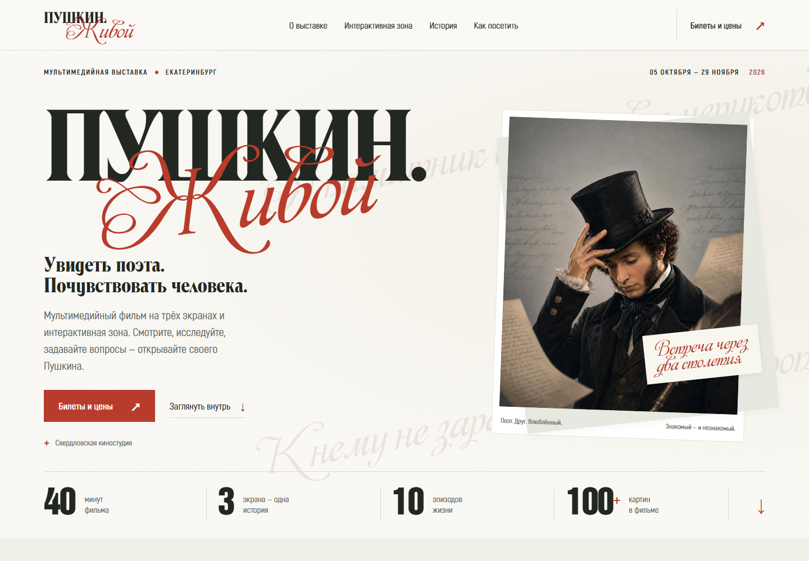

# Пушкин. Живой — светлый редизайн для Tilda

Готовая статичная страница с оригинальной типографикой, неподвижным портретом Пушкина на первом экране и десятью главами истории. Интерактивная зона объединяет стенды, сенсорные панели, разговор с цифровым Пушкиным, 3D-голограммы и фотозоны с демонстрацией оживающего изображения: осенним роликом и зимней картиной с эффектом снега. Отдельного раздела «Изображение оживает» больше нет. Таблица цен на будни и выходные сохранена из прайса, который пользователь предоставил 8 сентября 2026 года с просьбой разместить его на сайте.

Из обновлённой версии Claude выбраны рукописные строки Пушкина, лёгкая фактура бумаги, приглушённая зимняя живопись на фоне и тонкие рамки. Сохранена светлая палитра с шалфейными и красными акцентами.

Для интерактивной зоны использованы крупные фотографии прежней выставки R·ART с явными подписями об их происхождении. Изображение мультимедийного зала — обозначенная визуализация с произведениями из материалов Пушкина. Детский портрет показывается целиком; иллюстрации глав «Юг» и «Михайловское» сверены со сценарием. Новые предложения из соседней ветки Claude — логотип R·ART, карта, контакты, расписание и дополнительные карточки — ожидают выбора пользователя и не добавлены.

## Посмотреть

- Скачайте [автономный просмотр](Пушкин-Живой-просмотр.html) кнопкой **Download raw file** и откройте в браузере. Все изображения, шрифты и видео встроены в один файл.
- Или скачайте папку целиком и откройте [preview.html](preview.html), сохранив рядом `assets`.
- [Полная страница на компьютере](desktop.png) · [Мобильная версия](mobile.png).

GitHub показывает HTML как код. Это не опубликованный сайт; для интерактивного просмотра нужен скачанный HTML-файл.

## Перенести на Tilda

Подробный порядок — [НАЧАТЬ-ЗДЕСЬ.md](НАЧАТЬ-ЗДЕСЬ.md).

| Файл | Куда вставить содержимое |
| --- | --- |
| `01-head.html` | HEAD отдельной страницы |
| `02-styles-T123.html` | Следом в HEAD; теги `style` уже включены |
| `03-body-t123.html` | Первый блок T123 |
| `04-footer.html` | Второй T123, сразу после первого |

`02-styles.css` — исходный CSS без обёртки, дополнительная вставка не нужна. Отдельный сервер и библиотеки для работы сайта не требуются.

Изображения и осенний ролик находятся в `assets`; онлайн-вставки используют адреса jsDelivr, закреплённые за коммитом с материалами. Шрифты встроены в HEAD. Первый экран использует первоначальный `pushkin-hero.jpg`: видео, кнопка оживления, автозапуск, параллакс и приближение портрета убраны. Цены доступны; точное расписание сеансов и ссылка билетного оператора пока не предоставлены. Для подключения покупки укажите реальную ссылку в `PUSHKIN_EXHIBIT_CONFIG.ticketUrl` в FOOTER.

## Редактирование

Шаблоны — `source-templates/`. После их изменения запустите `python landing/redesign/build.py` из корня репозитория (нужна только стандартная библиотека Python). Скрипт обновит готовые вставки и оба вида просмотра. Снимки страницы сделаны отдельно; скрипт их не переснимает.

## Проверка текущей версии — 10 сентября 2026

Chrome, 320–1920 px: шрифты и изображения загружаются, горизонтальной прокрутки нет. Проверены статичный первый экран без видео и кнопки оживления, осенний ролик и снег внутри интерактивной зоны, переключение глав, клавиатура, мобильное меню, FAQ, уменьшение движения, ошибка видео и имитация обёрток Tilda.

На 320, 390, 768 и 1440 px отдельно проверены полный детский портрет, правильные картины для Юга и Михайловского, размеры новых фото и автономное переключение изображений. Все три проверенные картины отображаются с сохранением пропорций и без увеличения сверх исходного размера. Результат просмотрен на снимках телефона и компьютера. Реальная публикация в Tilda и покупка билетов не проверялись.

## История проверок

До добавления прайса и новых фоновых деталей проверено в Chrome, 320–1920 px: адаптивность, загрузка шрифтов и изображений, оба видео, переключение сцен, эффект снега, все главы, клавиатура, мобильное меню, Escape, FAQ, reduced motion, ошибка видео и повторная/поздняя вставка разметки. Проверена имитация стилей и обёрток Tilda. Реальная страница Tilda и покупка билетов пока не проверялись.

Эта запись относится к прежней версии с двумя роликами. Она не подтверждает проверку последних замен изображений и объединения разделов; результаты текущей проверки фиксируются отдельно.

[Источники и подтверждённые сведения](ИСТОЧНИКИ.md). Прежняя версия в `landing/tilda` сохранена; новый комплект находится только в этой папке.
