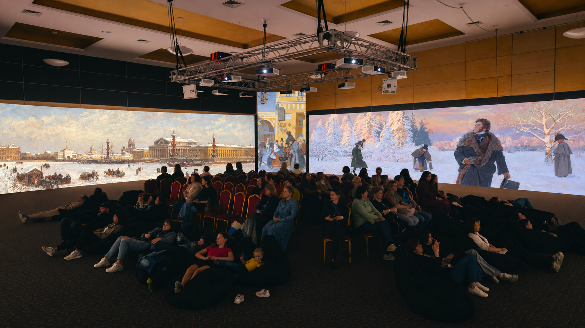

# Визуализация мультимедийного зала

Создана встроенным imagegen по прямой просьбе пользователя. Фактический размер результата — 1672×941 px; это визуализация на основе зала предыдущей выставки, а не документальный кадр будущей экспозиции. На странице это указано в подписи.

Исходники из Pushekb:
- `Зал/Salov072.JPG` — геометрия зала и зрители.
- «Петербург зимой», Александр Карлович Беггров — левый экран.
- «Дуэль А.С. Пушкина. Протаптывают тропинку», Дмитрий Белюкин — правый экран.
- «Невский проспект у кондитерской Вольфа и Беранже», Дмитрий Белюкин — фрагмент на центральной проекции.

Все исходники уже присутствуют в целевом репозитории. Изображение зала не используется как обещание точной расстановки произведений в будущем фильме.

## Финальный запрос к imagegen

Use case: compositing. Asset type: exhibition website, explicitly labelled design visualization, not a documentary photograph of the future Pushkin exhibition.
Edit target image 1 is the supplied real panoramic exhibition hall photograph Salov072.JPG. Supporting insert images 2, 3 and 4 are actual artworks from the Pushkin project: Alexander Beggrov's winter Petersburg, Dmitry Belyukin's Pushkin duel scene, and Dmitry Belyukin's Nevsky Prospekt near the confectionery of Wolf and Beranger.
Primary request: make a very sharp, professional, photorealistic visualization of this SAME room with ONLY these supplied artworks projected on its existing screens. Keep the exact architecture, ceiling, projector truss, walls, screen boundaries, chairs and seated audience. Replace ALL Surikov-related projections and the orange portrait in the middle. Place the Beggrov winter city on the broad left screen, the supplied Belyukin snowy duel scene as the main broad right screen, and a faithful recognizable detail of the supplied Belyukin Nevsky picture on the narrow central projection. Preserve the actual painting compositions and recognizable subjects, proportions, colors and brushwork; perspective-map the pictures naturally onto the actual screen planes. Do not invent new art or substitute generic historical imagery.
Keep realistic warm/cool projection spill and dark audience silhouettes, sharp image detail on the screens, natural exposure, no overglow or cinematic blur. Improve photo noise/compression only; do not hallucinate new people or room objects. No added titles, logos, callouts, frames, watermarks or promotional text. Keep existing artist marks if visible in the projected art.
Composition: wide landscape 16:9, 3072x1728 pixels if available; slightly trim excess ceiling/floor while preserving the room perspective and all screens. This should feel like a faithful high quality photographic composite, not an illustration.
